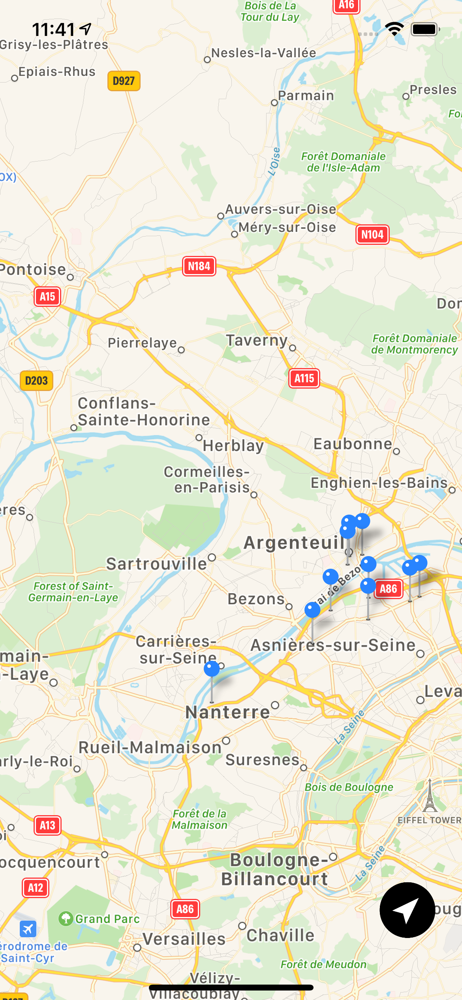
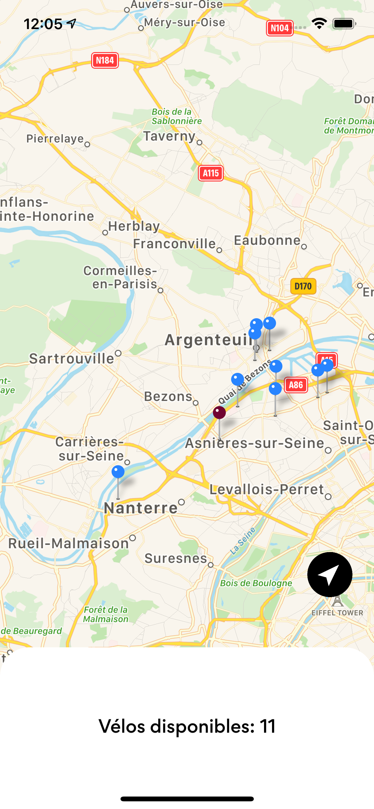

# Lilo

Lilo is an iOS app to visualize the ten closest velib stations in Paris from your location. It also supports the number of bikes available in each stations.

# Features

There are only two major features, show the closest Velib stations from your location and see how much available bikes there is. This project was intended to be small scope of features done well.

 

# Building the App

### Requirements

- XCode 12.3
- iOS 14.3 SDK

### Getting the source

First, check out the source, including all the dependencies:

`git clone git@github.com:maiSwann/Lilo.git`

### Building it

Open the project, Lilo.xcworkspace. 
Make sure to setup a default location by clicking on your simulator menu : Features - Location - Custom Location...
Build and Run
When the project is running, you can set a debug location directly on XCode : Debug - Simulate Location

# Licence

© All rights reserved - Maïlys Perez
